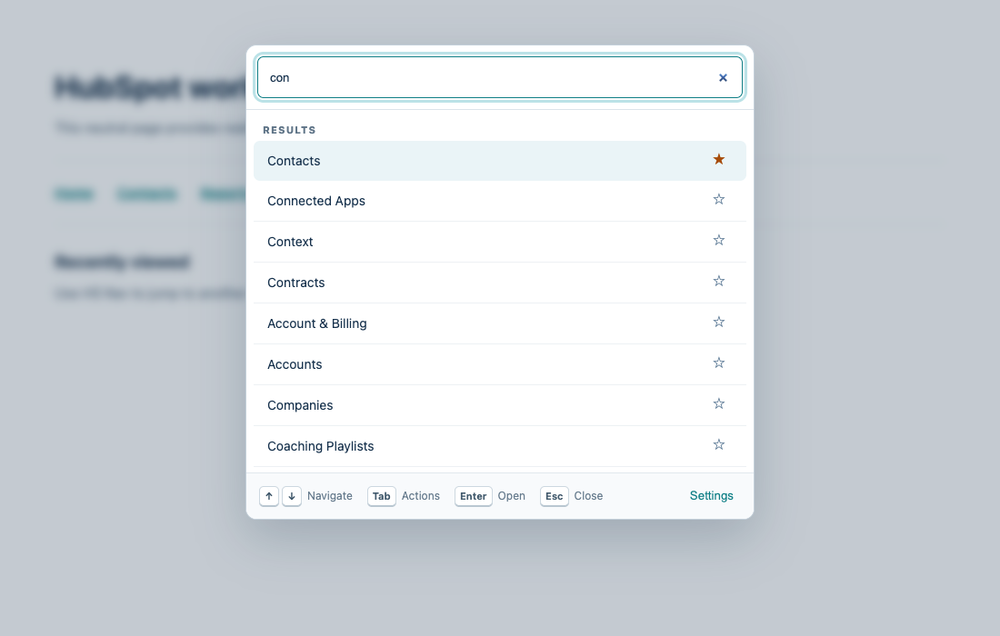

# HS Nav

[](https://github.com/danguenet/hs-nav/actions/workflows/build-and-zip.yml)
[](https://chromewebstore.google.com/detail/hs-nav/kgnoogdidhnefkepigajbifecfhajged)
[](LICENSE)

Keyboard-first navigation for HubSpot.



HubSpot's search is excellent for records, but reaching tools such as Segments, Campaigns, or Workflows can still take several clicks. HS Nav adds a fast launcher for product destinations, custom links, favorites, and recent destinations.

## Features

- Ranked, typo-tolerant search across maintained HubSpot destinations.
- Keyboard navigation, favorites, and recent destinations.
- Custom links that can keep or reuse a HubSpot subdomain and account ID.
- Import, export, validation, and reset tools for custom destinations.
- Support for secure regional and product-specific `hubspot.com` subdomains.
- Feedback when a destination requires account selection, is unavailable, or may have moved.
- A responsive, accessible launcher isolated from HubSpot page styles.

## Installation

### Chrome Web Store

Install [HS Nav from the Chrome Web Store](https://chromewebstore.google.com/detail/hs-nav/kgnoogdidhnefkepigajbifecfhajged). HS Nav requires Chrome 120 or newer.

### From source

```bash
git clone https://github.com/danguenet/hs-nav.git
cd hs-nav
npm ci
npm run build
```

Open `chrome://extensions`, enable **Developer mode**, choose **Load unpacked**, and select the generated `dist/` directory.

## Usage

| Action | Windows/Linux | macOS |
| --- | --- | --- |
| Open HS Nav | `Ctrl+Shift+K` | `Command+Shift+K` |
| Open HubSpot's record search | `Ctrl+K` | `Command+K` |

You can also open HS Nav from its toolbar icon. Chrome lets you customize extension shortcuts at `chrome://extensions/shortcuts`.

To add a custom link, open the extension settings and paste a secure HubSpot URL. You can keep the exact URL or opt in to following the current HubSpot subdomain, account, or both.

## Privacy and permissions

HS Nav has no server, analytics, or advertising. It uses Chrome storage for preferences and destination history, and requests access only to secure HubSpot subdomains. See the [privacy policy](PRIVACY_POLICY.md) for the complete data-handling and permission details.

## Development

Development requires Node.js 22 and Chrome 120 or newer.

```bash
npm ci
npm run check
```

Runtime modules live in `src/`, static extension files in `extension/`, and the canonical route catalog in `catalog/`. `npm run build` produces the complete Manifest V3 extension in `dist/`.

See [CONTRIBUTING.md](CONTRIBUTING.md) for contribution requirements and [docs/MAINTAINING.md](docs/MAINTAINING.md) for route-audit and release procedures.

## Contributing and support

Contributions are welcome. Please use the repository's issue templates for bugs, missing or stale routes, and feature requests. Read [CONTRIBUTING.md](CONTRIBUTING.md) before opening a pull request.

- For usage questions, see [SUPPORT.md](SUPPORT.md).
- For security or privacy concerns, follow [SECURITY.md](SECURITY.md) and do not open a public issue.
- Project changes are documented in [CHANGELOG.md](CHANGELOG.md).

## License and trademarks

HS Nav is available under the [MIT License](LICENSE).

HS Nav is an independent open-source project. It is not affiliated with, endorsed by, or sponsored by HubSpot, Inc. HubSpot and its product names are trademarks of their respective owners.
